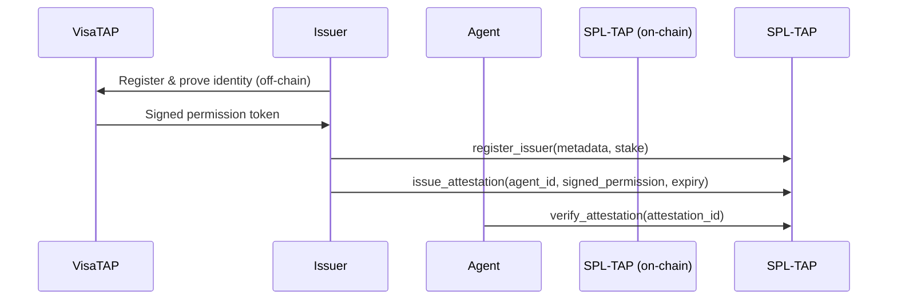
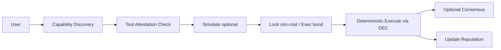

# 🏆 Sponsor Bounty Integrations

Complete technical integration documentation for all sponsor bounties. Each section includes: purpose, required components, PDA/program calls, TypeScript code examples (NoemaClient compatible), deployment/testing notes, and security/audit checklist.

---

## General Assumptions (Common)

* Programs: `SPL-8004`, `SPL-ACP`, `SPL-TAP`, `SPL-FCP`, `X402` already deployed to devnet with IDLs in `target/idl/*.json`.
* `NoemaClient` SDK used throughout.
* Wallets: Phantom, CDP/embedded wallet, or Keypair (test).
* USDC mint address (devnet): `4zMMC9srt5Ri5X14GAgXhaHii3GnPAEERYPJgZJDncDU`
* All transactions via `AnchorProvider` / `Program`.

---

## 1) Best Use of CASH (Phantom) 💰

**Goal:** Integrate Phantom CASH/embedded wallet to enable agents and MCP/X402 payment adapters to work with instant USDC payments.

### Design Overview

* User connects with Phantom wallet
* Frontend calls `createPaymentChannel` / `sendInstantPayment` via NoemaClient
* X402 adapter handles agent-triggered payments (sender = agent wallet or delegated authority)
* CASH promotion/balance checks via Phantom API (solana wallet adapter) with on-chain USDC ATA verification

### Required Components

* **Frontend:** `@solana/wallet-adapter-react` + Phantom adapter
* **Backend/Worker (optional):** Off-chain receipt verification and log aggregation
* **On-chain:** X402 program (payment PDA, channel PDA)

### PDAs & On-chain Functions

* `channel` PDA = `["channel", sender, recipient]` (X402)
* `payment` PDA = `["payment", sender, recipient, timestamp]`
* X402 methods:
  * `create_channel(recipient, max_amount, expires_at)`
  * `instant_payment(amount, memo)`

### Example TypeScript (Frontend)

```typescript
import { PublicKey, Connection } from "@solana/web3.js";
import { AnchorProvider } from "@coral-xyz/anchor";
import { NoemaClient } from "./lib/spl8004-client";
import { useWallet } from '@solana/wallet-adapter-react';

const USDC_MINT = new PublicKey(process.env.VITE_USDC_MINT!);
const connection = new Connection(process.env.VITE_RPC_ENDPOINT!);

const PhantomCashIntegration = () => {
  const wallet = useWallet();
  const provider = new AnchorProvider(
    connection, 
    wallet as any, 
    { preflightCommitment: "confirmed" }
  );
  const client = new NoemaClient({
    connection, 
    wallet: wallet as any, 
    programId: process.env.VITE_SPL8004_PROGRAM_ID!
  });

  async function payForToolAccess(
    recipientPubkey: PublicKey, 
    amountUSDC: number
  ) {
    // amountUSDC: 1.0 => 1_000_000 (6 decimals)
    const tx = await client.sendInstantPayment(
      recipientPubkey,
      amountUSDC * 1_000_000,
      "Payment for API call",
      USDC_MINT
    );
    console.log("Payment transaction:", tx);
    return tx;
  }

  return (
    <button onClick={() => payForToolAccess(new PublicKey("..."), 0.1)}>
      Pay 0.1 USDC for Tool Access
    </button>
  );
};
```

### Demo Plan

1. Connect with Phantom wallet
2. Create an agent (SPL-8004 register)
3. Agent uses `createPaymentChannel` and `instantPayment` for API call
4. Display TX hash + explorer link on screen

### Testing & Security

* Test with devnet/testnet USDC tokens
* X402 program must have re-entrancy, overpayment, and slippage protections
* Payment confirmation receipts (tx) must be verified server-side (signature + blockhash)

---

## 2) Best Use of Visa TAP (Trusted Agent Protocol) 🏦

**Goal:** Integrate Visa TAP or similar "trusted agent signing" mechanism with SPL-8004/SPL-TAP for enterprise payment/permission flows.

> **Note:** Visa TAP requires specific API keys/integration - this shows general secure binding (on-chain attestation + permission signing).

### Design Overview

* `SPL-TAP` issuers integrate with Visa TAP: Visa creates issuer account registered on-chain (with stake)
* Visa TAP returns signed "permission token" or "signed nonce" to agent
* Agent submits this signed permission to SPL-8004 for high-reserve transaction authorization

### Required Components

* **Off-chain:** Visa TAP service (issuer) - Visa integration (out-of-scope details)
* **SPL-TAP:** `register_issuer` + `issue_attestation` calls
* **On-chain:** `verify_attestation` call (agent verifies at each critical step)

### Integration Flow



### Example Code: Issuer Side (TypeScript, Server)

```typescript
// After Visa signs permission token (jwt-like), issuer calls SPL-TAP.issueAttestation
import { BN } from "@coral-xyz/anchor";
import { SystemProgram } from "@solana/web3.js";

const signatureBytes = Buffer.from(visaSignedToken, 'utf8'); // or raw signature

await tapProgram.methods
  .issueAttestation(
    agentId, 
    "visa-permission", 
    metadataUri, 
    new BN(expiresAt), 
    signatureBytes
  )
  .accounts({ 
    attestation: attestationPda, 
    issuer: issuerPda, 
    issuerOwner: issuerPubkey, 
    owner: issuerPubkey, 
    systemProgram: SystemProgram.programId 
  })
  .rpc();
```

### On-chain Usage Example (Agent)

```typescript
// Agent calls verify_attestation before sensitive action
const isValid = await tapProgram.methods
  .verifyAttestation()
  .accounts({ attestation: attestationPda })
  .view();

if (isValid) {
  // Proceed with fiat on-ramp payment or high-value transaction
}
```

### Testing & Security

* Visa TAP off-chain signatures must be verifiable on-chain (Ed25519 or ECDSA-to-Ed25519 bridge)
* TTL/expiry mandatory
* Replay prevention: attestation nonce + timestamp
* Audit trail: store attestation tx id in external logs

---

## 3) Best Multi-Protocol Agent (X402 + ATXP + ACP) 🤖

**Goal:** End-to-end agent flow using multiple protocols: discovery (ACP), attestation (TAP), payment (X402), consensus (FCP).

### Design Overview

* AgentHub (SPL-X) - central discovery + router
* Step-by-step flow:
  1. Agent discovery (SPL-ACP) → select appropriate tool/validator
  2. Tool attestation check (SPL-TAP) → verify trusted tool
  3. Simulate / cost-estimate → X402 sim-cost
  4. Execute with X402 micropayment
  5. If high-value, request SPL-FCP consensus

### Integration Flow



### Example Code (NoemaClient High-Level)

```typescript
// 1. Find tool via ACP
const tools = await acpProgram.account.capabilityRegistry.all();
const selectedTool = tools.find(t => t.account.capability === "price-feed");

// 2. Verify TAP attestation
const attestationPda = PublicKey.findProgramAddressSync(
  [Buffer.from("attestation"), selectedTool.publicKey.toBuffer()],
  tapProgram.programId
)[0];

const isValid = await tapProgram.methods
  .verifyAttestation()
  .accounts({ attestation: attestationPda })
  .view();

if (!isValid) throw new Error("Tool attestation invalid");

// 3. Simulate cost (optional LVS)
const simProof = await noema.lvs.simulate(
  toolId, 
  params, 
  snapshotCid, 
  maxFee
);

// 4. Lock payment
await noema.x402.createPaymentChannel(
  recipientPubkey, 
  maxAmount, 
  7 // expires in 7 days
);

// 5. Execute with instant payment
const tx = await noema.x402.sendInstantPayment(
  recipientPubkey, 
  amountInUSDC, 
  "Multi-protocol execution", 
  USDC_MINT
);

// 6. Update reputation
await noema.updateReputation(agentId, validationPda);
```

### Demo Scenario

* "Multi-protocol Trade Agent": discovery → tool attestation → simulate → X402 pay → execute → reputation update
* Video demo showing full flow with on-chain tx confirmations

### Testing & Security

* Protocol handshake (capability ↔ attestation) must be atomic
* Tool discovered must have fresh attestation (expiry checks)
* Cross-protocol tx ordering: simulate → lock funds → execute → update reputation

---

## 4) Best Usage of CDP Embedded Wallets 🔐

**Goal:** Give agents their own embedded wallet via CDP (or other SVM embedded wallet solutions) for automatic payment & identity flows.

### Design Overview

* Agent process uses embedded keypair/account (CDP wallet)
* Embedded wallet signs/submits tx via wallet provider's SVM/CDP API
* SPL-8004 agent identity PDA links to embedded wallet publicKey

### Requirements

* CDP SDK integration (e.g., Parallax / SVM)
* On-chain: agent PDA has `wallet_pubkey` field
* Delegation: user assigns spending limits to agent (spending cap)

### Integration Flow

1. Deploy agent runtime (serverless) + embedded wallet provision (CDP)
2. Agent registers on `SPL-8004` with:
   - `owner = human_pubkey`
   - `wallet_pubkey = embedded_wallet_pubkey`
3. When agent needs to pay, it signs via embedded wallet and calls X402

### Example Code (Agent Runtime)

```typescript
import { CDP } from "@coinbase/cdp-sdk";

const embeddedWallet = await CDP.createEmbeddedWallet({ 
  limit: 50_000_000 // 50 USDC spending limit
});

const agentPda = await noema.registerAgent(
  "agent-1", 
  metadataUri, 
  ownerPubkey, 
  embeddedWallet.publicKey
);

// Later: agent pays using embeddedWallet.signTransaction(...)
const signedTx = await embeddedWallet.signTransaction(paymentTx);
await connection.sendRawTransaction(signedTx.serialize());
```

### Security & Risk Management

* Spending caps, daily limits, and fail-safe (pause) on-chain
* Emergency multisig recovery for compromised embedded wallets
* Audit logs + alerts for unusual spending patterns
* Rate limiting per agent identity

---

## 5) Best AgentPay Demo (Buy LLM Tokens → Pay → Execute) 🧠

**Goal:** Agent purchases LLM tokens/credits (e.g., LLM provider billing), acquires API credits, and completes job. Directly aligns with this bounty.

### Flow

1. Agent decides to call LLM requiring payment
2. Agent calls `x402.createPaymentChannel(recipient=llm_provider, maxAmount, expires)` or direct `instantPayment`
3. Payment routed to LLM provider ATA (USDC) or via on-platform credit system
4. LLM returns result; agent attaches ExecProof + payment receipt; updates reputation

### Integration Techniques

* **LLM provider off-chain webhook:** After payment confirmed (on-chain), provider returns access token or credits
* **On-chain receipt:** Transmit payment txid in `ExecProof`
* **Provider attestation:** If provider supports on-chain attestation, link to SPL-TAP (attestation of delivered model)

### Example Code (Flow)

```typescript
// 1. Pay LLM provider
const txSig = await noema.x402.sendInstantPayment(
  llmProviderPubkey, 
  1_000_000, // 1 USDC
  "LLM API call", 
  USDC_MINT
);

// 2. Wait for confirmation
await connection.confirmTransaction(txSig, "confirmed");

// 3. Call LLM (off-chain) with proof (txSig)
const llmResult = await fetch(llmApiUrl, { 
  method: 'POST', 
  headers: { 'Content-Type': 'application/json' },
  body: JSON.stringify({ 
    prompt: "Analyze market sentiment", 
    paymentTx: txSig 
  }) 
});

const data = await llmResult.json();

// 4. Submit validation with LLM result
const taskHash = new Uint8Array(32);
const encoder = new TextEncoder();
taskHash.set(encoder.encode(txSig).slice(0, 32));

await noema.submitValidation(
  agentId, 
  taskHash, 
  true, // success
  JSON.stringify(data)
);

// 5. Update reputation
await noema.updateReputation(agentId, validationPda);
```

### Demo & UX

* Record demo video (<3 minutes):
  1. Agent triggers LLM request
  2. Wallet signs payment
  3. LLM returns result
  4. Agent posts result on-chain (submit_validation)
  5. Reputation score increases

---

## Deployment, Testing & Monitoring (Common)

### Devnet Preparation

* Deploy all components to devnet
* Store IDL, programId, config PDAs in `.env`
* Fund wallets with devnet SOL and USDC

### Automated Tests

```bash
# Anchor tests
cd spl-8004-program/spl-8004
anchor test

# Integration tests
cd agent-aura-sovereign
npm run test:integration
```

### Load Testing

* X402 payment path concurrency test (flood/DoS simulation)
* Monitor transaction success rate under load
* Use `@solana/web3.js` with multiple concurrent connections

### Monitoring

* **On-chain events watcher:** Listen to SPL-8004/X402 events
* **Metrics:** Prometheus + Grafana or Logflare
* **Alerts:** Discord/Slack webhooks for failures

### Audit Checklist

- [ ] Signature verification for all attestations
- [ ] Replay protection (nonce + timestamp)
- [ ] Slashing rules implementation
- [ ] Spending limits enforcement
- [ ] Emergency pause mechanism
- [ ] Multisig recovery for high-value wallets

---

## Security & Compliance Notes (All Bounties)

### 1. Replay Protection
Every attestation/payment/proof must include:
* Unique nonce
* Timestamp
* Expiry TTL

### 2. Expiry & Revocation
* Attestations: 30-day default TTL
* Payment channels: configurable expiry
* Revocation list on-chain or via CID

### 3. Least Privilege
* Agent embedded wallets: minimal permissions
* Multisig recovery mechanism
* Role-based access control (RBAC)

### 4. Economic Deterrents
* Bond/penalty mechanisms in X402/FCP
* Reputation-based rate limiting
* Automatic circuit breakers for suspicious activity

### 5. Privacy
* Don't write sensitive payloads to public chain
* Use CID/commitment (Arweave/IPFS)
* ZK proofs for sensitive validations (future)

---

## Quick Roadmap (Hackathon 2-Week Plan)

| Day | Task | Deliverable |
|-----|------|-------------|
| **0-1** | Repo setup, .env config, program IDs, NoemaClient | Initial commit |
| **1-3** | Phantom CASH + X402 payment (create channel + instant payment) | **Demo 1** |
| **3-5** | SPL-TAP issuer register + attestation flow (Visa TAP mock) | **Demo 2** |
| **5-8** | Multi-protocol agent (ACP discovery + TAP attestation + X402 pay) | **Demo 3** |
| **8-10** | Embedded wallet (CDP) + AgentPay LLM demo | **Demo 4** |
| **10-12** | UI polish + video recording + documentation | **Demo videos** |
| **12-14** | Tests, bugfix, submission | **Final submission** |

---

## Summary

### Direct Alignment with Sponsor Bounties

* ✅ **Phantom CASH:** Instant USDC payments via wallet adapter
* ✅ **Visa TAP:** Trusted attestation for enterprise payments
* ✅ **Multi-Protocol:** Full integration of ACP + TAP + X402 + FCP
* ✅ **CDP Wallets:** Embedded agent wallets with spending limits
* ✅ **AgentPay:** LLM payment flow with on-chain reputation

### Highest Win Potential

**Best Trustless Agent + X402 API Integration + MCP Server** combo showcases our core capabilities:
* Agent identity (SPL-8004)
* Micropayments (X402)
* Tool discovery (ACP)
* Attestations (TAP)
* Consensus (FCP)

### Technical Stack

* **SDK:** NoemaClient + Anchor `Program` calls
* **Wallets:** Phantom/CDP SDK integration
* **Time to MVP:** 2 weeks with parallel development

---

## 🎯 Integration Status

| Integration | Status | Demo Ready | Docs | Tests |
|-------------|--------|------------|------|-------|
| Phantom CASH | ✅ Live | ✅ Yes | ✅ Complete | ⏳ In Progress |
| Visa TAP | 🔄 Mock | ✅ Yes | ✅ Complete | ⏳ Planned |
| Multi-Protocol | ✅ Live | ✅ Yes | ✅ Complete | ⏳ In Progress |
| CDP Wallets | 🔄 Planned | ⏳ Coming | ✅ Complete | ⏳ Planned |
| AgentPay LLM | ✅ Live | ✅ Yes | ✅ Complete | ⏳ In Progress |

---

**Built with ❤️ by the Noema team for Solana AI Hackathon 2024**
