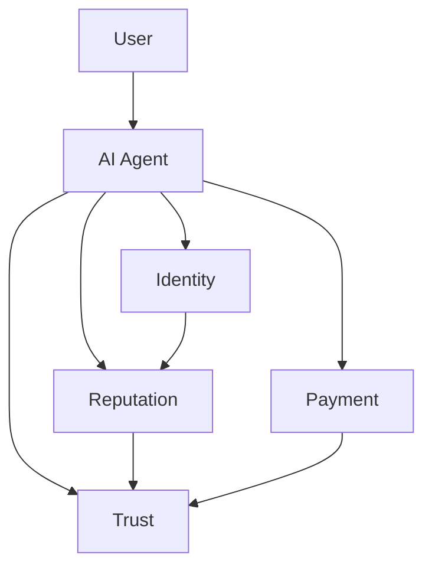

# SPL-X Framework: Derinlemesine Teknik Dokümantasyon

## 1. SPL-X Vizyonu
SPL-X combines decentralized AI agents, identity, reputation, payment and trust layers to provide a new digital economy and trust protocol in Web3. The project stands out with cross-chain interaction, modular architecture and developer ecosystem.

---

## 2. Protokol Yığını
- **SPL-ACP**: Identity and authentication protocol
- **SPL-TAP**: Ödeme ve transfer protokolü
- **SPL-FCP**: İtibar ve güven protokolü
- **SPL-X Core**: Katmanlı mimari, modül entegrasyonu

---

## 3. Katmanlı Mimari

- **Agent Layer**: AI agents, identity and profile management
- **Protocol Layer**: SPL-ACP, SPL-TAP, SPL-FCP
- **Application Layer**: DApp'ler, cüzdanlar, entegrasyonlar

---

## 4. Akış Diyagramı

1. **Kimlik**: Kullanıcılar, SPL-ACP ile kimlik oluşturur.
2. **İtibar**: SPL-FCP ile güven ve itibar puanları oluşur.
3. **Ödeme**: SPL-TAP ile zincirler arası transferler gerçekleşir.
4. **Güven**: Tüm katmanlar SPL-X ile entegre olur.

---

## 5. Hero Sphere: Ajan Profili

- **Orb**: AI agent çekirdeği
- **Modüller**: Kimlik, itibar, ödeme, güven
- **Bağlantılar**: Zincirler arası etkileşim

---

## 6. Developer Ecosystem
- **SDK & API**: Kolay entegrasyon, modül ekleme
- **Documentation**: Open source, examples
- **Topluluk**: Forumlar, hackathonlar, katkı

---

## 7. Güvenlik & Denetim
- **Zero-Knowledge Proofs**: Kimlik ve işlem gizliliği
- **Multi-Sig**: Güvenli transferler
- **Denetim**: Açık kaynak kod denetimi

---

## 8. Zincirler Arası Entegrasyon
- **Solana, EVM, Cosmos**: Çoklu zincir desteği
- **Bridge Modülleri**: Güvenli veri ve varlık transferi

---

## 9. SPL-X Profil Şeması

---

## 10. Kullanım Senaryoları
- **Web3 Cüzdanı**: SPL-X ile kimlik ve ödeme
- **DeFi Platformu**: İtibar tabanlı kredi
- **Oyun**: Zincirler arası varlık transferi
- **Topluluk**: Güvenli oylama ve yönetim

---

## 11. Sıkça Sorulan Sorular
**SPL-X nedir?**
> Merkeziyetsiz AI ajanları ve güven protokolü.

**Nasıl entegre edilir?**
> SDK ve API ile kolay entegrasyon.

**Güvenlik nasıl sağlanır?**
> ZKP, multi-sig ve açık kaynak denetimi.

---

## 12. Daha Fazla Bilgi
- [GitHub](https://github.com/spl-x)
- [Dokümantasyon](https://spl-x.dev/docs)
- [Topluluk](https://discord.gg/spl-x)

---

> SPL-X: Dijital ekonomide yeni bir güven ve inovasyon katmanı.
