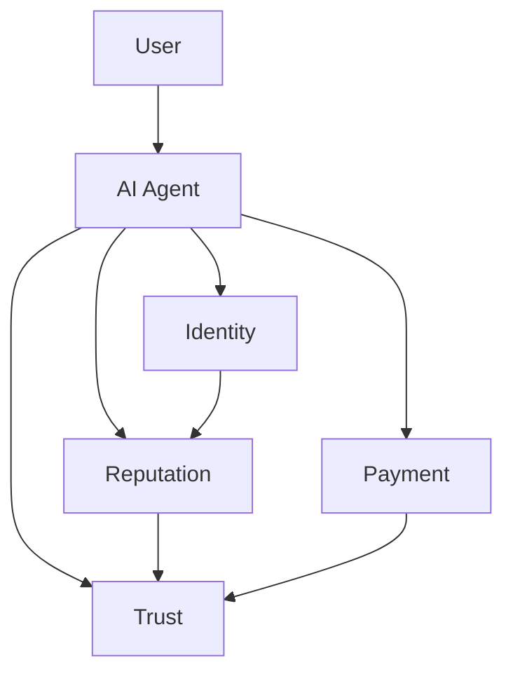

# SPL-X Framework: In-Depth Technical Documentation

## 1. SPL-X Vision
SPL-X combines decentralized AI agents, identity, reputation, payment, and trust layers to offer a new digital economy and trust protocol in Web3. The project stands out with cross-chain interaction, modular architecture, and developer ecosystem.

---

## 2. Protocol Stack
- **SPL-ACP**: Identity and authentication protocol
- **SPL-TAP**: Payment and transfer protocol
- **SPL-FCP**: Reputation and trust protocol
- **SPL-X Core**: Layered architecture, module integration

---

## 3. Layered Architecture

- **Agent Layer**: AI agents, identity and profile management
- **Protocol Layer**: SPL-ACP, SPL-TAP, SPL-FCP
- **Application Layer**: DApps, wallets, integrations

---

## 4. Flow Diagram

1. **Identity**: Users create identity with SPL-ACP.
2. **Reputation**: Trust and reputation scores are created with SPL-FCP.
3. **Payment**: Cross-chain transfers occur with SPL-TAP.
4. **Trust**: All layers integrate with SPL-X.

---

## 5. Hero Sphere: Agent Profile

- **Orb**: AI agent core
- **Modules**: Identity, reputation, payment, trust
- **Connections**: Cross-chain interaction

---

## 6. Developer Ecosystem
- **SDK & API**: Easy integration, module addition
- **Documentation**: Open source, examples
- **Community**: Forums, hackathons, contributions

---

## 7. Security & Audit
- **Zero-Knowledge Proofs**: Identity and transaction privacy
- **Multi-Sig**: Secure transfers
- **Audit**: Open source code review

---

## 8. Cross-Chain Integration
- **Solana, EVM, Cosmos**: Multi-chain support
- **Bridge Modules**: Secure data and asset transfer

---

## 9. SPL-X Profile Schema

---

## 10. Use Cases
- **Web3 Wallet**: Identity and payment with SPL-X
- **DeFi Platform**: Reputation-based credit
- **Gaming**: Cross-chain asset transfer
- **Community**: Secure voting and governance

---

## 11. Frequently Asked Questions
**What is SPL-X?**
> Decentralized AI agents and trust protocol.

**How to integrate?**
> Easy integration with SDK and API.

**How is security ensured?**
> ZKP, multi-sig and open source audit.

---

## 12. Learn More
- [GitHub](https://github.com/spl-x)
- [Documentation](https://spl-x.dev/docs)
- [Community](https://discord.gg/spl-x)

---

> SPL-X: A new layer of trust and innovation in the digital economy.
