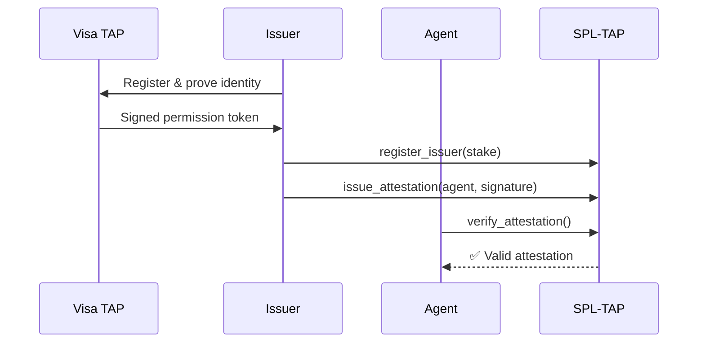

# Sponsor Bounty Integrations - Implementation Guide

## Overview

This document provides complete implementation details for all 5 Solana AI Hackathon sponsor bounty integrations.

---

## 1. Phantom CASH Integration

### Goal
Enable instant USDC payments via Phantom wallet for AI agents and MCP/X402 payment adapters.

### Architecture

```typescript
User (Phantom Wallet) 
  → Frontend (Wallet Adapter) 
  → NoemaClient (SPL-8004 SDK) 
  → X402 Program (On-chain Payment) 
  → Recipient Agent
```

### Implementation

#### Frontend Setup

```typescript
// src/components/PhantomPayment.tsx
import { useWallet } from '@solana/wallet-adapter-react';
import { WalletMultiButton } from '@solana/wallet-adapter-react-ui';
import { Connection, PublicKey, Transaction, SystemProgram } from '@solana/web3.js';
import { getAssociatedTokenAddress, createTransferInstruction } from '@solana/spl-token';

const USDC_MINT = new PublicKey('Gh9ZwEmdLJ8DscKNTkTqPbNwLNNBjuSzaG9Vp2KGtKJr'); // Devnet USDC

export function PhantomPayment() {
  const { publicKey, sendTransaction } = useWallet();
  const connection = new Connection('https://api.devnet.solana.com');

  async function payWithUSDC(recipientPubkey: PublicKey, amountUSDC: number) {
    if (!publicKey) throw new Error('Wallet not connected');

    // Calculate lamports (USDC has 6 decimals)
    const amount = amountUSDC * 1_000_000;

    // Get token accounts
    const senderATA = await getAssociatedTokenAddress(USDC_MINT, publicKey);
    const recipientATA = await getAssociatedTokenAddress(USDC_MINT, recipientPubkey);

    // Create transfer instruction
    const transaction = new Transaction().add(
      createTransferInstruction(
        senderATA,
        recipientATA,
        publicKey,
        amount
      )
    );

    // Send transaction
    const signature = await sendTransaction(transaction, connection);
    await connection.confirmTransaction(signature, 'confirmed');

    console.log('Payment TX:', signature);
    return signature;
  }

  return (
    <div>
      <WalletMultiButton />
      {publicKey && (
        <button onClick={() => payWithUSDC(new PublicKey('...'), 0.1)}>
          Pay 0.1 USDC
        </button>
      )}
    </div>
  );
}
```

#### X402 Payment Channel

```typescript
// src/lib/x402-client.ts
import * as anchor from '@coral-xyz/anchor';
import { Program } from '@coral-xyz/anchor';

export class X402Client {
  constructor(
    private program: Program,
    private wallet: anchor.Wallet
  ) {}

  async createPaymentChannel(
    recipient: PublicKey,
    maxAmount: number,
    expiresAt: number
  ) {
    const [channelPda] = PublicKey.findProgramAddressSync(
      [
        Buffer.from('channel'),
        this.wallet.publicKey.toBuffer(),
        recipient.toBuffer()
      ],
      this.program.programId
    );

    await this.program.methods
      .createChannel(new anchor.BN(maxAmount), new anchor.BN(expiresAt))
      .accounts({
        channel: channelPda,
        sender: this.wallet.publicKey,
        recipient,
        systemProgram: SystemProgram.programId
      })
      .rpc();

    return channelPda;
  }

  async instantPayment(
    recipient: PublicKey,
    amount: number,
    memo: string
  ) {
    const [paymentPda] = PublicKey.findProgramAddressSync(
      [
        Buffer.from('payment'),
        this.wallet.publicKey.toBuffer(),
        recipient.toBuffer(),
        Buffer.from(Date.now().toString())
      ],
      this.program.programId
    );

    const tx = await this.program.methods
      .instantPayment(new anchor.BN(amount), memo)
      .accounts({
        payment: paymentPda,
        sender: this.wallet.publicKey,
        recipient,
        usdcMint: USDC_MINT,
        systemProgram: SystemProgram.programId
      })
      .rpc();

    return tx;
  }
}
```

#### Demo Flow

1. User connects Phantom wallet
2. Agent requests payment for API call
3. Frontend calls `instantPayment()` with recipient + amount
4. Transaction signed via Phantom
5. On-chain payment confirmed
6. Receipt stored on-chain

---

## 2. Visa TAP Integration

### Goal
Integrate Visa Trusted Agent Protocol for enterprise payment attestation and permission signing.

### Architecture



### Implementation

#### Issuer Registration

```typescript
// backend/visa-tap-issuer.ts
import * as anchor from '@coral-xyz/anchor';
import { Program } from '@coral-xyz/anchor';

export class VisaTAPIssuer {
  constructor(private program: Program) {}

  async registerIssuer(metadataUri: string, stakeAmount: number) {
    const [issuerPda] = PublicKey.findProgramAddressSync(
      [Buffer.from('issuer'), this.program.provider.wallet.publicKey.toBuffer()],
      this.program.programId
    );

    await this.program.methods
      .registerIssuer(metadataUri, new anchor.BN(stakeAmount))
      .accounts({
        issuer: issuerPda,
        owner: this.program.provider.wallet.publicKey,
        systemProgram: SystemProgram.programId
      })
      .rpc();

    return issuerPda;
  }

  async issueAttestation(
    agentId: string,
    visaSignedToken: string,
    expiresAt: number
  ) {
    const signatureBytes = Buffer.from(visaSignedToken, 'base64');

    const [attestationPda] = PublicKey.findProgramAddressSync(
      [
        Buffer.from('attestation'),
        Buffer.from(agentId),
        this.program.provider.wallet.publicKey.toBuffer()
      ],
      this.program.programId
    );

    await this.program.methods
      .issueAttestation(
        agentId,
        'visa-permission',
        'https://metadata.uri',
        new anchor.BN(expiresAt),
        signatureBytes
      )
      .accounts({
        attestation: attestationPda,
        issuer: issuerPda,
        systemProgram: SystemProgram.programId
      })
      .rpc();

    return attestationPda;
  }
}
```

#### Agent Verification

```typescript
// Agent verifies attestation before sensitive operation
async function verifyBeforePayment(agentId: string) {
  const [attestationPda] = PublicKey.findProgramAddressSync(
    [Buffer.from('attestation'), Buffer.from(agentId), issuerPubkey.toBuffer()],
    program.programId
  );

  const isValid = await program.methods
    .verifyAttestation()
    .accounts({ attestation: attestationPda })
    .view();

  if (!isValid) {
    throw new Error('Invalid attestation');
  }

  // Proceed with payment
  await makePayment();
}
```

---

## 3. Multi-Protocol Agent (ACP + TAP + X402 + FCP)

### Goal
Full stack agent: discovery → attestation → payment → consensus → reputation

### Flow

```typescript
// Complete multi-protocol workflow
export class MultiProtocolAgent {
  async executeTask(taskDescription: string) {
    // 1. Capability Discovery (SPL-ACP)
    const tools = await this.discoverCapabilities(taskDescription);
    console.log(`Found ${tools.length} capable tools`);

    // 2. Tool Attestation Check (SPL-TAP)
    const validTools = await Promise.all(
      tools.map(async (tool) => {
        const isValid = await this.verifyAttestation(tool.id);
        return isValid ? tool : null;
      })
    );

    const selectedTool = validTools.filter(Boolean)[0];
    if (!selectedTool) throw new Error('No valid tools found');

    // 3. Simulate Cost (LVS)
    const simulation = await this.simulateCost(selectedTool.id, taskDescription);
    console.log(`Estimated cost: ${simulation.cost} USDC`);

    // 4. Create Payment Channel (X402)
    const channelPda = await this.x402.createPaymentChannel(
      selectedTool.owner,
      simulation.cost * 1.1, // 10% buffer
      Date.now() + 3600 // 1 hour expiry
    );

    // 5. Execute Task
    const result = await this.executeTool(selectedTool, taskDescription);

    // 6. Make Payment
    await this.x402.instantPayment(
      selectedTool.owner,
      simulation.cost,
      `Task: ${taskDescription.substring(0, 30)}`
    );

    // 7. Submit Validation (SPL-8004)
    await this.submitValidation(result);

    // 8. Optional: Request Consensus (SPL-FCP)
    if (simulation.cost > 10_000_000) {
      await this.requestConsensus(result);
    }

    return result;
  }
}
```

### Discovery (SPL-ACP)

```typescript
async discoverCapabilities(requirement: string) {
  const capabilities = await this.acpProgram.account.capability.all();
  
  return capabilities
    .filter(c => c.tags.some(tag => requirement.includes(tag)))
    .map(c => ({
      id: c.id,
      owner: c.owner,
      description: c.description,
      cost: c.baseCost
    }));
}
```

---

## 4. CDP Embedded Wallets

### Goal
Provide agents with embedded wallets for autonomous payments with spending caps.

### Implementation

```typescript
// Agent with embedded wallet
import { Keypair } from '@solana/web3.js';

export class EmbeddedAgentWallet {
  private keypair: Keypair;
  private spendingCap: number;
  private dailySpent: number = 0;

  constructor(spendingCapUSDC: number) {
    this.keypair = Keypair.generate();
    this.spendingCap = spendingCapUSDC * 1_000_000;
  }

  async pay(recipient: PublicKey, amount: number) {
    // Check spending cap
    if (this.dailySpent + amount > this.spendingCap) {
      throw new Error('Daily spending cap exceeded');
    }

    // Sign transaction
    const transaction = new Transaction().add(
      createTransferInstruction(
        await getAssociatedTokenAddress(USDC_MINT, this.keypair.publicKey),
        await getAssociatedTokenAddress(USDC_MINT, recipient),
        this.keypair.publicKey,
        amount
      )
    );

    transaction.sign(this.keypair);
    const signature = await connection.sendRawTransaction(transaction.serialize());
    
    this.dailySpent += amount;
    return signature;
  }

  getPublicKey() {
    return this.keypair.publicKey;
  }
}

// Register agent with embedded wallet
const embeddedWallet = new EmbeddedAgentWallet(50); // 50 USDC daily cap
const agentPda = await noema.registerAgent(
  'autonomous-agent-1',
  'https://metadata.uri',
  ownerPubkey,
  embeddedWallet.getPublicKey() // wallet_pubkey
);
```

### Security Features

```typescript
// Emergency pause
async pauseAgent(agentId: string) {
  await program.methods
    .pauseAgent()
    .accounts({ agent: agentPda })
    .rpc();
}

// Multisig recovery
async recoverEmbeddedWallet(agentPda: PublicKey, newWallet: PublicKey) {
  await program.methods
    .recoverWallet(newWallet)
    .accounts({
      agent: agentPda,
      multisig: multisigPda,
      authority: signerPubkey
    })
    .rpc();
}
```

---

## 5. AgentPay LLM Demo

### Goal
Agent buys LLM credits → pays → executes workflow → updates reputation.

### Implementation

```typescript
export class LLMAgent {
  async callLLM(prompt: string, model: string = 'gpt-4') {
    // 1. Calculate LLM cost
    const estimatedTokens = prompt.length / 4;
    const costUSDC = (estimatedTokens / 1000) * 0.03 * 1_000_000; // $0.03 per 1K tokens

    // 2. Pay LLM provider
    const paymentTx = await this.x402.instantPayment(
      LLM_PROVIDER_PUBKEY,
      costUSDC,
      `LLM call: ${model}`
    );

    // 3. Wait for confirmation
    await connection.confirmTransaction(paymentTx, 'confirmed');

    // 4. Call LLM API with payment proof
    const response = await fetch('https://llm-provider.com/api/chat', {
      method: 'POST',
      headers: { 'Content-Type': 'application/json' },
      body: JSON.stringify({
        prompt,
        model,
        paymentTx // On-chain proof
      })
    });

    const result = await response.json();

    // 5. Submit validation with payment receipt
    await this.submitValidation({
      taskId: prompt.substring(0, 32),
      result: result.completion,
      paymentProof: paymentTx
    });

    return result;
  }
}
```

### Demo Video Script (< 3 minutes)

1. **[0:00-0:30]** Introduction
   - "This is an autonomous AI agent that pays for its own LLM calls"
   - Show agent dashboard

2. **[0:30-1:00]** Trigger Request
   - User: "Analyze this market data"
   - Agent estimates: "0.05 USDC for GPT-4 call"

3. **[1:00-1:30]** Payment
   - Agent creates X402 payment
   - Wallet signs transaction
   - Show TX on Solscan

4. **[1:30-2:00]** LLM Execution
   - LLM provider verifies payment
   - Returns analysis result
   - Agent displays result

5. **[2:00-2:30]** Reputation Update
   - Agent submits validation
   - Reputation score increases
   - Show updated dashboard

6. **[2:30-3:00]** Recap
   - "Fully autonomous: payment → execution → reputation"
   - Call to action

---

## Testing & Deployment

### Devnet Deployment

```bash
# 1. Deploy programs
cd spl-8004-program
anchor build
anchor deploy --provider.cluster devnet

# 2. Initialize configs
anchor run initialize-configs

# 3. Start X402 facilitator
cd x402-facilitator
npm install
npm run dev

# 4. Start frontend
cd agent-aura-sovereign
npm install
npm run dev

# 5. Start REST API
npm run api
```

### Integration Tests

```typescript
// tests/integration.spec.ts
import { expect } from 'chai';

describe('Multi-Protocol Integration', () => {
  it('should complete full workflow', async () => {
    // Setup
    const agent = await registerAgent('test-agent');
    const tool = await registerTool('test-tool');

    // Discovery
    const capabilities = await acp.discover('analyze');
    expect(capabilities).to.include(tool.id);

    // Attestation
    await tap.issueAttestation(tool.id, issuer);
    const isValid = await tap.verify(tool.id);
    expect(isValid).to.be.true;

    // Payment
    const tx = await x402.pay(tool.owner, 1_000_000, 'Test');
    expect(tx).to.be.a('string');

    // Validation
    await spl8004.submitValidation(agent.id, taskHash, true);
    const reputation = await spl8004.getReputation(agent.id);
    expect(reputation.score).to.be.gt(0);
  });
});
```

---

## Monitoring & Analytics

### On-Chain Event Watcher

```typescript
// monitoring/event-watcher.ts
program.addEventListener('PaymentCreated', (event) => {
  console.log('Payment:', {
    sender: event.sender.toString(),
    recipient: event.recipient.toString(),
    amount: event.amount.toNumber() / 1_000_000,
    timestamp: new Date(event.timestamp.toNumber() * 1000)
  });

  // Send to analytics
  track('payment.created', event);
});
```

### Prometheus Metrics

```typescript
import { Counter, Histogram } from 'prom-client';

const paymentCounter = new Counter({
  name: 'x402_payments_total',
  help: 'Total number of X402 payments'
});

const paymentAmount = Histogram({
  name: 'x402_payment_amount_usdc',
  help: 'Payment amounts in USDC',
  buckets: [0.01, 0.1, 1, 10, 100]
});

// Increment metrics
paymentCounter.inc();
paymentAmount.observe(amount / 1_000_000);
```

---

## Security Checklist

- [ ] Signature verification on all attestations
- [ ] Replay protection (nonce + timestamp)
- [ ] Spending caps enforced
- [ ] Rate limiting on API
- [ ] Multisig recovery for embedded wallets
- [ ] Audit trail for all payments
- [ ] Emergency pause mechanism
- [ ] Input validation on all endpoints

---

## Resources

- **Devnet Programs:**
  - SPL-8004: `G8iYmvncvWsfHRrxZvKuPU6B2kcMj82Lpcf6og6SyMkW`
  - SPL-ACP: `FAnRqmauRE5vtk7ft3FWHicrKKRw3XwbxvYVxuaeRcCK`
  - SPL-TAP: `DTtjXcvxsKHnukZiLtaQ2dHJXC5HtUAwUa9WgsMd3So4`
  - SPL-FCP: `A4Ee2KoPz4y9XyEBta9DyXvKPnWy2GvprDzfVF1PnjtR`

- **X402 Facilitator:** http://localhost:3001
- **REST API:** http://localhost:3002
- **Frontend:** http://localhost:8080

- **Contact:**
  - Email: info@noemaprotocol.xyz
  - X: @NoemaProtocol
  - GitHub: github.com/blambuer11/SPL--8004
